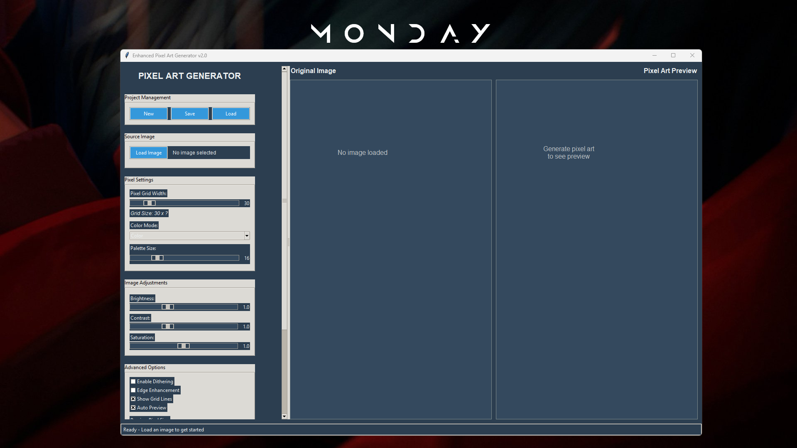
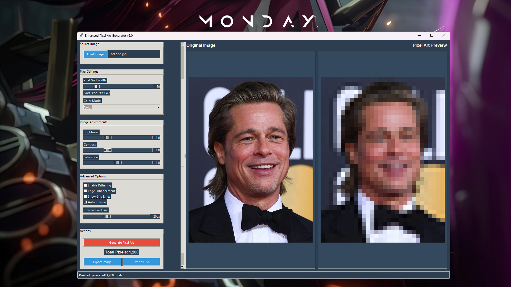

# 🎨 PixelCraft Generator

[](https://python.org)
[](LICENSE)
[]()

> **Transform any image into stunning pixel art with advanced customization options and real-time preview!**

PixelCraft Generator is a powerful, user-friendly desktop application built with Python and Tkinter that converts regular images into beautiful pixel art. Whether you're a game developer, digital artist, or just love retro aesthetics, this tool provides professional-grade features with an intuitive interface.

## ✨ Features

### 🖼️ **Image Processing**
- **Multiple format support**: JPEG, PNG, BMP, GIF, TIFF
- **Real-time adjustments**: Brightness, contrast, saturation
- **Edge enhancement**: Sharpen details before pixelation
- **Advanced dithering**: Floyd-Steinberg algorithm for smooth gradients

### 🎨 **Pixel Art Generation**
- **Flexible grid sizes**: 10x10 to 150x150 pixels
- **Multiple color modes**: Full color, grayscale, limited palette
- **Customizable palettes**: 2-64 colors with intelligent quantization
- **Live preview**: See changes instantly as you adjust settings

### 💾 **Export Options**
- **High-quality exports**: PNG, JPEG, BMP formats
- **Custom pixel sizes**: 5px to 100px per pixel
- **Grid overlay options**: Show/hide grid lines
- **Data exports**: JSON, CSV, and text formats for developers

### 🔧 **Advanced Features**
- **Project management**: Save and load complete projects
- **Color palette viewer**: Analyze and export color schemes
- **Batch processing ready**: Extensible architecture
- **Cross-platform**: Works on Windows, macOS, and Linux

## 🚀 Quick Start

### Prerequisites
- Python 3.7 or higher
- pip (Python package installer)

### Installation

1. **Clone the repository**:
   ```bash
   git clone https://github.com/hhhpraise/pixelcraft-generator.git
   cd pixelcraft-generator
   ```

2. **Install dependencies**:
   ```bash
   pip install -r requirements.txt
   ```

3. **Run the application**:
   ```bash
   python pixelcraft_generator.py
   ```

### Dependencies
```
Pillow>=9.0.0
numpy>=1.21.0
```

## 📖 Usage Guide

### Basic Workflow
1. **Load an Image**: Click "Load Image" and select your source image
2. **Adjust Settings**: Configure pixel grid size, color mode, and image adjustments
3. **Generate**: Click "Generate Pixel Art" to create your pixel art
4. **Export**: Save your creation in your preferred format

### Advanced Features

#### **Image Adjustments**
- **Brightness**: Range from 0.5 (darker) to 2.0 (brighter)
- **Contrast**: Enhance or reduce image contrast (0.5-2.0)
- **Saturation**: Control color intensity (0.0-2.0)

#### **Color Modes**
- **Full Color**: Preserves original colors
- **Grayscale**: Classic black and white pixel art
- **Limited Palette**: Reduces colors to specified count (2-64)

#### **Export Formats**
- **Image Files**: PNG (recommended), JPEG, BMP
- **Data Files**: JSON (with metadata), CSV, TXT
- **Custom Settings**: Adjustable pixel size and grid visibility

### Project Management
Save your work as `.pixelproj` files to preserve all settings and allow easy iteration on your designs.

## 🖥️ Screenshots

### Main Interface

*Clean, intuitive interface with real-time preview*

### Usage

*Analyze and export color schemes*


## 🛠️ Development

### Setting up Development Environment

1. **Fork and clone** the repository
2. **Create virtual environment**:
   ```bash
   python -m venv venv
   source venv/bin/activate  # On Windows: venv\Scripts\activate
   ```
3. **Install development dependencies**:
   ```bash
   pip install -r requirements-dev.txt
   ```

### Code Style
- Follow PEP 8 guidelines
- Use type hints where applicable
- Write docstrings for all public methods
- Keep functions focused and modular


## 🤝 Contributing

Contributions are welcome! Here are some ways you can help:

### 🐛 **Bug Reports**
- Use the issue tracker to report bugs
- Include steps to reproduce the issue
- Provide system information (OS, Python version)

### 💡 **Feature Requests**
- Suggest new features or improvements
- Explain the use case and benefit
- Consider implementation complexity

### 🔧 **Code Contributions**
1. Fork the repository
2. Create a feature branch (`git checkout -b feature/amazing-feature`)
3. Make your changes with tests
4. Commit your changes (`git commit -m 'Add amazing feature'`)
5. Push to the branch (`git push origin feature/amazing-feature`)
6. Open a Pull Request

### Priority Areas for Contribution
- **Batch processing**: Process multiple images at once
- **Additional export formats**: SVG, WebP support
- **Performance optimization**: Faster processing for large images
- **UI improvements**: Dark mode, custom themes
- **Advanced algorithms**: Alternative pixelation methods

## 📝 Changelog

### v2.0.0 (Latest)
- ✨ Complete UI redesign with modern styling
- 🎨 Advanced color palette management
- 🔧 Dithering and edge enhancement options
- 💾 Enhanced project save/load system
- 🚀 Threading support for large images
- 📊 Multiple export formats (JSON, CSV)

### v1.0.0
- 🎉 Initial release
- 🖼️ Basic image to pixel art conversion
- 💾 Simple export functionality
- 🎛️ Basic adjustment controls

## 📄 License

This project is licensed under the MIT License - see the [LICENSE](LICENSE) file for details.

## 🙏 Acknowledgments

- **Pillow (PIL)** - Python Imaging Library for image processing
- **NumPy** - Numerical computing support
- **Tkinter** - GUI framework (part of Python standard library)
- **Community** - Thanks to all contributors and users!

## 📞 Support

- **Issues**: [GitHub Issues](https://github.com/hhhpraise/pixelcraft-generator/issues)
- **Discussions**: [GitHub Discussions](https://github.com/hhhpraise/pixelcraft-generator/discussions)
- **Email**: hhhpraise33@gmail.com

## 🔮 Roadmap

### Short Term (v2.1)
- [ ] Batch processing support
- [ ] Custom color palette import/export
- [ ] Undo/Redo functionality
- [ ] Keyboard shortcuts

### Medium Term (v3.0)
- [ ] Plugin system for custom algorithms
- [ ] Web-based version
- [ ] Animation support (GIF processing)
- [ ] Command-line interface

### Long Term
- [ ] Machine learning-based optimization
- [ ] Cloud processing integration
- [ ] Mobile app versions
- [ ] Collaborative editing features

---

<div align="center">

**Made with ❤️ by [Hhhpraise]**

[⭐ Star this repo](https://github.com/hhhpraise/pixelcraft-generator) if you find it useful!

</div>